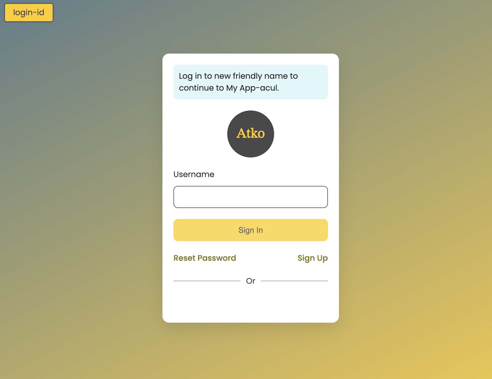

## Getting started
### Step 1:
```
npm install
npm run build
```

### Step2:
Host the assets `index.js` and `index.css` files on CDN or a local server.

### Step3:
Register the assets with Auth0 using UL Management API:
```
PATCH
https://<CustomDomain>/api/v2/prompts/login-id/screen/login-id/rendering
```

### Step 4:
Open the universal login page 
- It can be configured via any existing client app from quickstarts 

- Open directly from manage dashboard


### Step 5:
With above steps configured correctly, user should be able to see a login page similar to below screenshot

